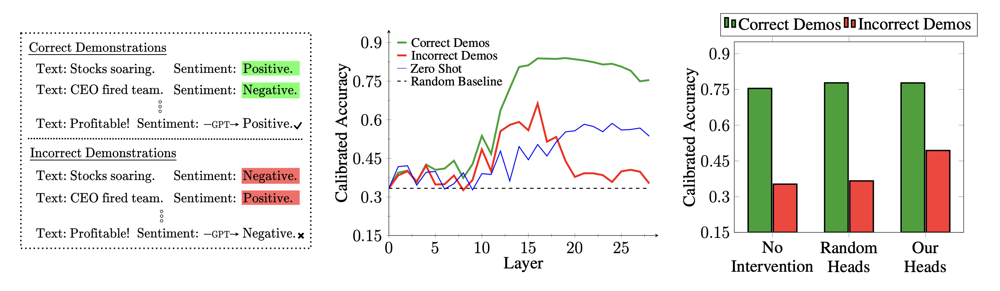

# Overthinking the Truth: Understanding how Language Models Process False Demonstrations



We developed this codebase to study few-shot learning on text classification tasks. More specifically, we seek to understand how language models process prompts containing false demonstrations. Our code makes it possible to:
- Use the [logit lens](https://www.lesswrong.com/posts/AcKRB8wDpdaN6v6ru/interpreting-gpt-the-logit-lens) and calibration to decode the model’s intermediate computations
- Compute statistics on attention heads (where they read from and write to)
- Ablate attention heads to analyse how such interventions affect model behavior

We've made it easy to scale the codebase to other datasets, models, and settings.

## Requirements
The code requires a single GPU (see [colab](https://research.google.com/colaboratory/faq.html) for free GPU access). There is no training, and inference is relatively cheap. A GPU with high RAM will be needed, however, to run larger models; for example, an A100 40GB and A100 80GB were used to run GPT-J and GPT-NeoX20B, respectively. If you are limited by memory, consider initializing the model with fp16.

## Dependecies
We recommend creating a new anaconda environment to simplify package management:
```
conda create -n overthinking_the_truth python=3.11
source activate overthinking_the_truth
pip install -r requirements.txt
```

One can also simply run:
```
pip install -r requirements.txt
```

## Demo Notebooks
See `notebooks/demo` for a walkthrough of our pipeline.

## Replicating Our Results
### Logit Lens
Run the following inside `scripts/logit_lens` with a choice of {model(s), dataset(s), setting(s)}:
 ```
python logit_lens.py --models {models} --datasets {datasets} --settings {settings} --num_inputs {#inputs} --num_demos {#demos}
```
Concretely, the following script executes for `gpt_j` on the datasets `sst2, dbpedia` with `permuted incorrect labels` on `1000` inputs and `40` demonstrations per input.
 ```
python logit_lens.py --models gpt_j --datasets sst2,dbpedia --settings permuted_incorrect_labels --num_inputs 1000 --num_demos 40
```
To replicate all our logit_lens results, run the following command.
```
python logit_lens.py --models all --datasets all --settings all --num_inputs 1000 --num_demos "max"
```

### Attention
Run the following inside `scripts/attention` with a choice of {model(s), dataset(s)}:
 ```
python attention.py --models {models} --datasets {datasets} --num_inputs {#inputs} --num_demos {#demos}
```
To replicate all our attention results, run the following command.
```
python attention.py --models all --datasets unnatural --num_inputs 250 --num_demos "max"
```

### Ablations
Run the following inside `scripts/logit_lens` with a choice of {model(s), dataset(s), setting(s)}:
 ```
python ablations.py --models {models} --datasets {datasets} --settings {settings} --abl_types {ablation_types} --num_inputs {#inputs} --num_demos {#demos}
```
To replicate all our ablation results, run the following command.
```
python ablations.py --models gpt_j --datasets all --settings all --abl_types all --num_inputs 1000 --num_demos max & python ablations.py --models gpt2_xl,gpt_neox --datasets all --settings all --abl_types attention,mlp --num_inputs 1000 --num_demos max
```

# Analyzing Results
See `notebooks/analysis` to analyze the output of the scripts. For example, after running the logit_lens script, the `notebooks/analysis/logit_lens` notebook will generate the layerwise plots.

## Citation
```
@misc{halawi2023overthinking,
      title={Overthinking the Truth: Understanding how Language Models Process False Demonstrations}, 
      author={Danny Halawi and Jean-Stanislas Denain and Jacob Steinhardt},
      year={2023},
      eprint={2307.09476},
      archivePrefix={arXiv},
      primaryClass={cs.LG}
}
```

## Contributions and Contact
This code was developed by Danny Halawi and Jean-Stanislas Denain. Questions about the codebase can be directed to us ({dhalawi, js_denain}@berkeley.edu, respectively). If you find an issue, please open an issue. If you'd like to contribute, feel free to open a pull request.
